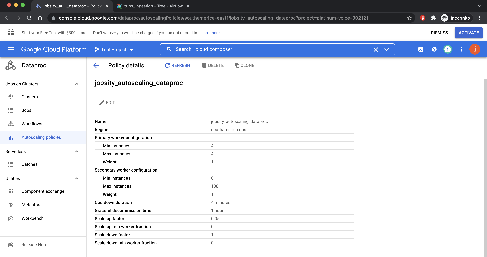

- [Overview](#overview)
- [Structure](#structure)
  - [1. Buckets](#1-buckets)
  - [2. Cloud Composer](#2-cloud-composer)
  - [3. Dataproc](#3-dataproc)
  - [4. Big Query](#4-big-query)
- [Execution](#execution)
  - [1. Failure Scenario:](#1-failure-scenario)
  - [2 .Success Scenario:](#2-success-scenario)
## Overview

- This project represents an automatic process to ingest data on an on-demand basis. The data represents trips taken by different vehicles, and include a city, a point of origin and a destination.
- This automation is orchestrated through Cloud Composer (Airflow), this way:
  1. Dag is started (dag is currenlty configured to be executed on-demand through the start button);
  2. An dataproc operator (or task) initiates an ephemeral cluster with 1 master node and 4 worker nodes using machines types n1-standard-2. It also is configured to use an pre-defined auto-scaling policy to allow a maximum of 100 additional secundary workers.
  3. Pyspark job is automaically executed inside this cluster, reads the data represting the trips, perform a simple aggregation on it and load the data into BigQuery.
  4. Cluster is deleted.

- Once logged in the console. You can select one of the four components used by this project:


## Structure

### 1. Buckets

https://console.cloud.google.com/storage/browser?project=platinum-voice-302121


1. [dataproc-staging-sa-east1-624051846217-s1xkzqzc](https://console.cloud.google.com/storage/browser/dataproc-staging-sa-east1-624051846217-s1xkzqzc;tab=objects?forceOnBucketsSortingFiltering=false&project=platinum-voice-302121): bucket generated by the Dataproc cluster to store staging files

2. [dataproc-temp-sa-east1-624051846217-qm4ygy4o](https://console.cloud.google.com/storage/browser/dataproc-temp-sa-east1-624051846217-qm4ygy4o;tab=objects?forceOnBucketsSortingFiltering=false&project=platinum-voice-302121): bucket generated by the Dataproc cluster to store temporary files

3. [jobsity-bq-temp](https://console.cloud.google.com/storage/browser/jobsity-bq-temp;tab=objects?forceOnBucketsSortingFiltering=false&project=platinum-voice-302121): Bucket used by spark job in the ingestion process. It is required by BigQuery API to to store any temporary data while writing into to BigQuery table.

4. [southamerica-east1-jobsity--99ba5591-bucket](https://console.cloud.google.com/storage/browser/southamerica-east1-jobsity--99ba5591-bucket;tab=objects?forceOnBucketsSortingFiltering=false&project=platinum-voice-302121): bucket used by Cloud Composer (Airflow). 

   - Here we can store the dags:

     

   

5. [jobsity_challenge](https://console.cloud.google.com/storage/browser/jobsity_challenge;tab=objects?forceOnBucketsSortingFiltering=false&project=platinum-voice-302121): main folder for the project. It contains:

   1. **gs://jobsity_challenge/data/raw/**: here it is where the **trips.csv** should be stored. 
   2. **gs://jobsity_challenge/libs/bigquery-connector/**: contains the BigQuery dependency in order for the pyspark job to write into BigQuery.
   3. **gs://jobsity_challenge/spark_jobs/trips/**: It contains:
      1. the **cluster_init_action.sh**. This is a simple file that will be called during the inialization of the dataproc cluster to perform some initial actions. In this case, it will simply copy the BigQuery jar file *$SPARK_HOME/jars* in order for this jar to be automatically loaded in the spark job.
         1. the ingestion job: **ingestion.py**. This is a PySpark job responsible to read the **trips.csv** raw file, perform the need transformation and then load this transformed data (also called **trusted_data**) to BigQuery dataset: **platinum-voice-302121:jobsity_trusted**.


### 2. Cloud Composer

https://console.cloud.google.com/composer/environments?project=platinum-voice-302121

- Cloud composer is the orchestrator responsible to **automatize the  process to ingest and store the data**. 

- This is also the way to, through a **console application** to **inform the user about the status of the data ingestion without using a polling solution**.


- First, I created some airflow variables used by the dag:


- Copied the dag file to the **dags** folder in the bucket [southamerica-east1-jobsity--99ba5591-bucket](https://console.cloud.google.com/storage/browser/southamerica-east1-jobsity--99ba5591-bucket;tab=objects?forceOnBucketsSortingFiltering=false&project=platinum-voice-302121).

- And then, with a simple click we are able to start the ingestion and monitor its status:

  


### 3. Dataproc

https://console.cloud.google.com/dataproc/clusters?project=platinum-voice-302121

- This is the cluster responsible to run the pyspark ingestion job, in order to extract data from raw layer (), do a pre-processing in that data to load it into the trusted layer ().

- In order for the solution to be scalable, I manually created the following policy:

  ```shell
  export BUCKET_NAME=jobsity_challenge
  export PROJECT_ID=$(gcloud config get-value core/project)
  export PROJECT_NUMBER=$(gcloud projects list --filter="$(gcloud config get-value project)" --format="value(PROJECT_NUMBER)")
  
  gcloud config set project $PROJECT_ID
  gcloud dataproc autoscaling-policies import jobsity_autoscaling_dataproc \
      --source=autoscaling_policy.yaml \
      --project=$PROJECT_ID \
      --region=southamerica-east1
  ```

  

- This way, if needed, cluster will automatically scale up to 100 workers.

> This might not working in this project due to budget/quota limitation, as this is a trial account.


### 4. Big Query

https://console.cloud.google.com/bigquery?project=platinum-voice-302121&d=jobsity_trusted&p=platinum-voice-302121&t=TRIPS&page=table&ws=!1m5!1m4!4m3!1splatinum-voice-302121!2sjobsity_trusted!3sTRIPS

- This is the SQL database. It is the datawarehouse where the ingested data will be stored and where the required queries can be executed:


## Execution

### 1. Failure Scenario:


- To avoid extra costs, cluster is automatically deleted:


### 2 .Success Scenario:


- Cluster being created


-  with auto-scaling policy:


- Cluster created. Ingestion running:

  


- Ingestion ended Sucessfully:


- Big Query Data:


- View with weekly average number of trips for an area, defined by a bounding box (given by coordinates) or by a region:

  > I choosed to use "by a region".


- Regions that has the "cheap_mobile" datasource appeared in:


- Latest datasource from the two most commonly appearing regions,:

